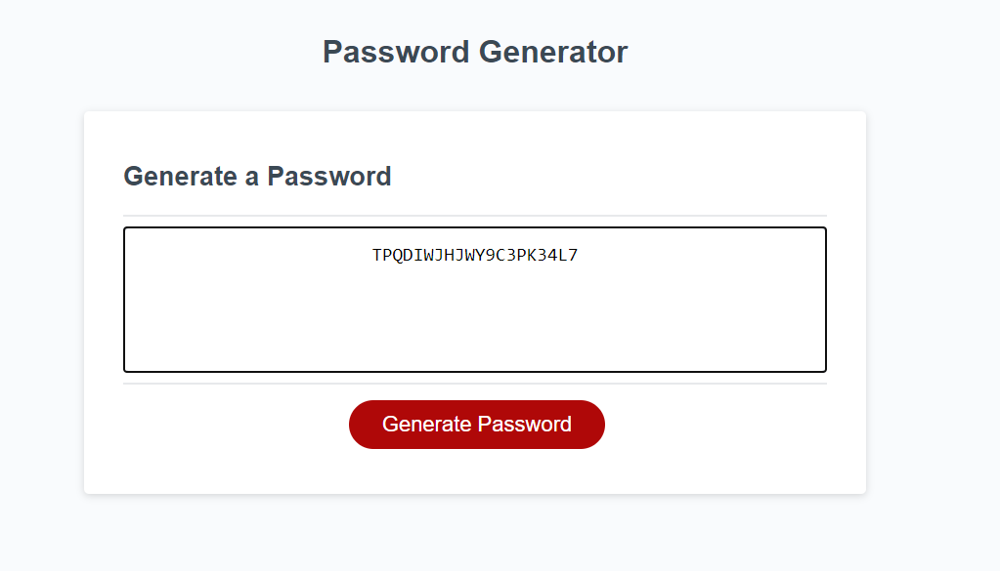

# Password Generator

## Description
password-generator uses javascript in order to generate a password between 8 and 128 characters long. It was written to give users an instant way to create strong and secure passwords. The user is first asked for the password length. They are then asked if they wish to include numbers, lower case letters, upper case letters or special characters. Once these variables are confirmed a list is concatenated and randomized. The final result is a password generated based upon the inputs given.

## Table of Contents
* [Installation](#installation)
* [Usage](#usage)
* [Credits](#credits)
* [License](#license)

## Installation 
password-generator is linked to the index.html file. It will run when opened in any browser.

## Usage
To begin click "Generate Password". A window alert will pop up asking the user to choose between 8 and 128 characters length. Then choose "ok" or "cancel" to each of the 4 windows asking if numbers, lower case letters, upper case letters, or special characters will be used. Upon completion a randomly generated password meeting the chosen requirements will appear.

## Credits

password-generator was created in coordination with Xander Rapstine. Xander created the HTML and CSS files while I created the Javascript file functionality.
